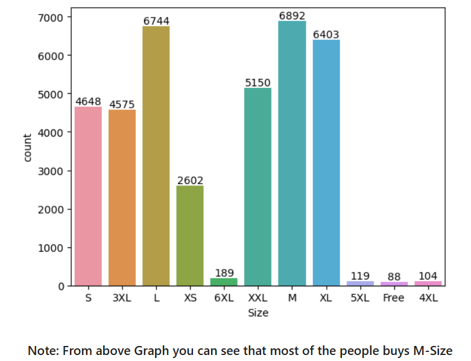
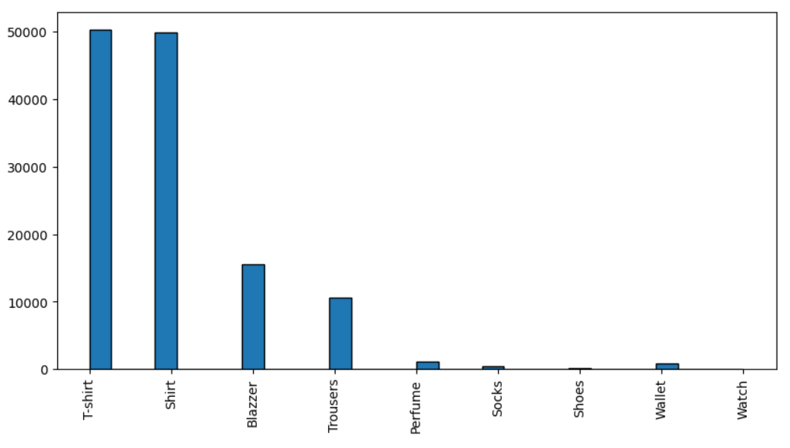
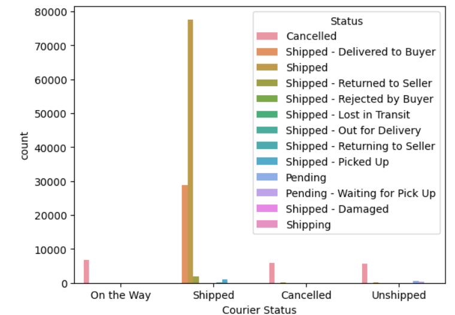
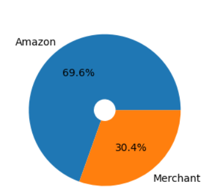
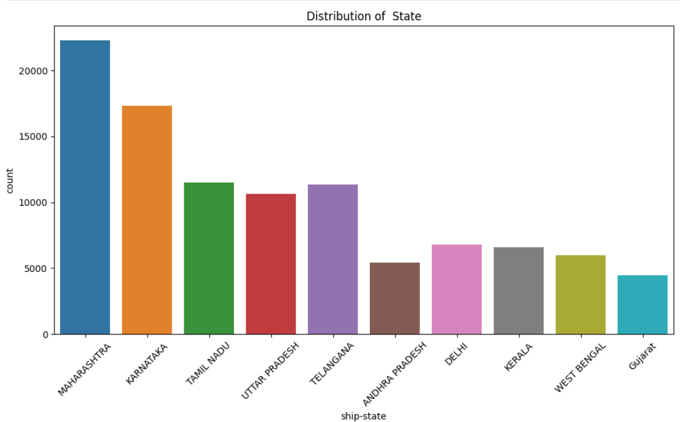

# Amazon Sales Data Analysis — Python

## Business Objective

This project analyzes Amazon e-commerce sales data to identify product, customer, fulfillment, and geographic patterns that can support inventory, marketing, and fulfillment decisions.

## Dataset

- **Source file:** `Amazon Sale Report.csv`
- **Raw rows:** 128,976
- **Rows after the documented null-removal step:** 37,514
- **Raw columns:** 21
- **Columns retained after documented cleaning:** 19
- **Period:** April 2022 – June 2022

## Data Preparation

The notebook performs the following documented preparation steps:

1. Removes irrelevant/blank columns.
2. Handles rows containing null values.
3. Converts `ship-postal-code` to integer type.
4. Converts `Date` to datetime.
5. Renames `Qty` to `Quantity`.

The cleaned dataset is then used for exploratory analysis.

## Business Questions

- Which product categories have the highest order volume?
- Which sizes are most frequently purchased?
- What fulfillment method dominates the dataset?
- What is the mix of B2B versus retail orders?
- Which states contribute the highest sales volume?

## Key Findings

The analysis identifies:

- **T-shirts** as the leading product category.
- **M** as the most common product size.
- **Easy Ship** as the dominant fulfillment method in the dataset.
- A heavily **retail-oriented** customer mix, with the documented analysis reporting approximately 99.3% retail and 0.7% B2B.
- **Maharashtra** as the state with the highest sales volume in the analyzed dataset.

## Visual Analysis

### Product Size

### Product Category

### Fulfillment

### B2B vs Retail

### Geographic Analysis

## Interview Talking Points

This project demonstrates a practical Python analytics workflow:

**Raw CSV → data cleaning → datatype handling → exploratory analysis → visualization → business interpretation**

The main analytical focus is not only plotting charts, but converting transaction-level data into actionable observations about products, customers, fulfillment, and geography.

## Repository Files

- `Amazon Sale Report.ipynb` — analysis notebook
- `Amazon Sale Report.csv` — source dataset
- `Amazon Sale Report.ipynb - Colab.pdf` — notebook export
- PNG files — analytical visualizations

## Tech Stack

**Python | Pandas | NumPy | Matplotlib | Seaborn | Jupyter/Colab**
