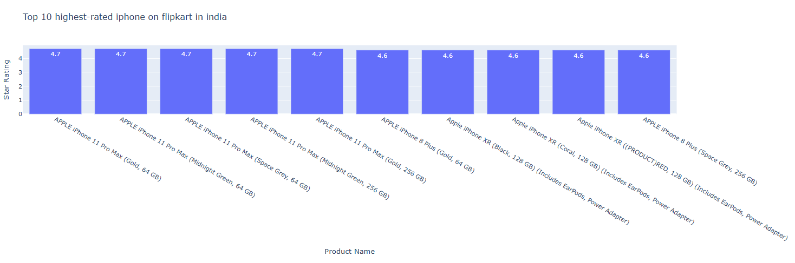
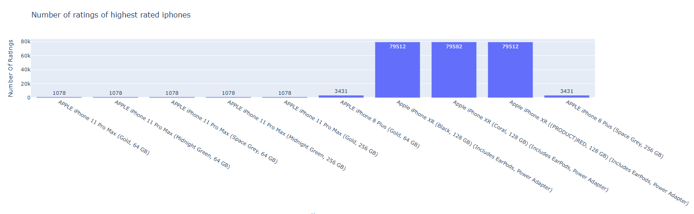
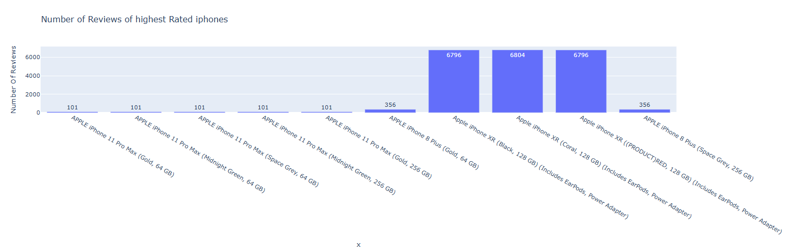
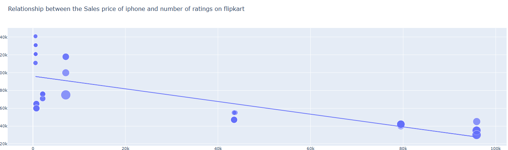
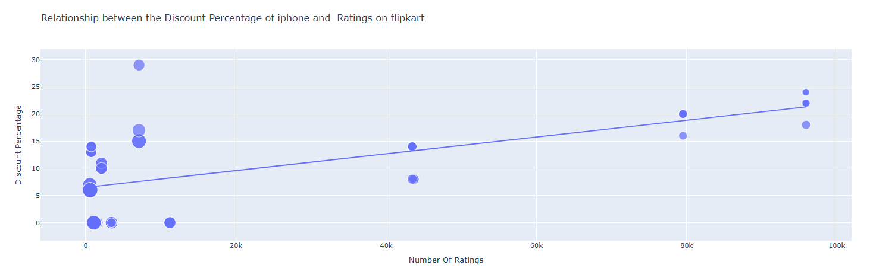

# 📱 Flipkart iPhone Sales Analysis  

## 📝 Problem Statement  
Apple iPhones are among the most popular smartphones in India, available across multiple models, storage sizes, and price ranges.  
This analysis aims to understand **pricing, ratings, and customer preferences** to uncover trends such as:  
- Which iPhones are **highest rated** on Flipkart?  
- How do **price and ratings** correlate?  
- What role do **discounts** play in influencing customer decisions?  
- Which models are **most and least expensive**?  

---

## 📂 Dataset Overview  
- **Source:** Flipkart product listings  
- **Shape:** 62 rows × 11 columns  
- **Key Columns:**  
  - Product Name  
  - Brand  
  - Sale Price & MRP  
  - Discount %  
  - Star Rating  
  - Number of Ratings & Reviews  
  - RAM  

---

## 🧹 Data Cleaning  
- Verified no missing/null values  
- Removed duplicates  
- Converted `Sale Price`, `MRP`, and `Discount %` into numeric formats  
- Ensured proper datatypes for statistical analysis  

---

## 📊 Analysis & Findings  

### 1️⃣ Top 10 Highest-Rated iPhones  
  

**Findings:**  
- iPhone 11 Pro / Pro Max dominate ⭐ 4.7 ratings  
- iPhone 8 Plus (Gold, 64 GB) has the **highest engagement** (95k+ ratings, 8k+ reviews)  
- All top iPhones rated **above 4.5** → strong brand trust  

---

### 2️⃣ Ratings Count Distribution  
  

**Findings:**  
- iPhone 8 Plus far ahead in ratings volume  
- iPhone 12 and 11 Pro Max get moderate attention  
- Customers continue buying older iPhones in bulk  

---

### 3️⃣ Reviews Distribution  
  

**Findings:**  
- Reviews follow the same trend as ratings  
- Majority of reviews concentrated on budget-friendly/older iPhones  

---

### 4️⃣ Price vs Ratings  
  

**Findings:**  
- Negative trend → **lower-priced iPhones attract more ratings**  
- Affordability is a key driver in Indian market  

---

### 5️⃣ Discount vs Ratings  
  

**Findings:**  
- High discounts don’t always lead to higher ratings  
- Suggests customers trust **consistent pricing** over “flashy offers”  

---

### 6️⃣ Most vs Least Expensive iPhones  

- 💸 **Least Expensive:** iPhone SE (White, 64 GB) – ₹29,999  
- 💎 **Most Expensive:** iPhone 12 Pro (Silver, 512 GB) – ₹1,40,900  

**Findings:**  
- iPhone SE → **best value-for-money**, gets max ratings  
- iPhone 12 Pro → premium niche, few buyers  

---

## 📈 Key Insights  
- 📌 Customers trust and rate **older iPhones** just as high as newer ones  
- 📌 **Price sensitivity** plays a major role in ratings volume  
- 📌 Discounts do not strongly influence customer satisfaction  
- 📌 **Budget models (SE, 8 Plus)** dominate in popularity compared to premium ones  

---

## 📊 Metrics (for self-project)  
Since this is an independent data analysis, we can define success metrics as:  
- ✅ Number of models analyzed → **62**  
- ✅ Rating distribution range → **4.3 to 4.7 stars**  
- ✅ Price range analyzed → **₹29,999 – ₹1,40,900**  
- ✅ Engagement analyzed → **95k+ ratings, 8k+ reviews**  

---

## 🚀 Tools Used  
- **Python**: Pandas, Plotly  
- **IDE**: Jupyter Notebook  
- **Version Control**: Git & GitHub  

---
