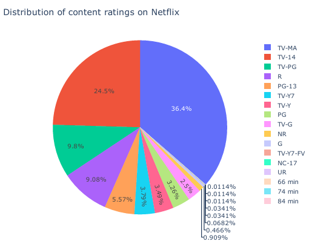
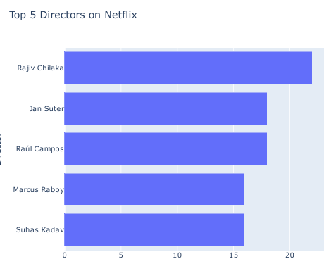
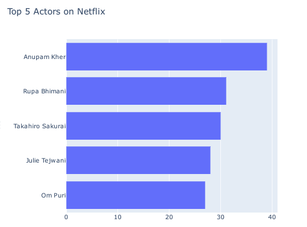
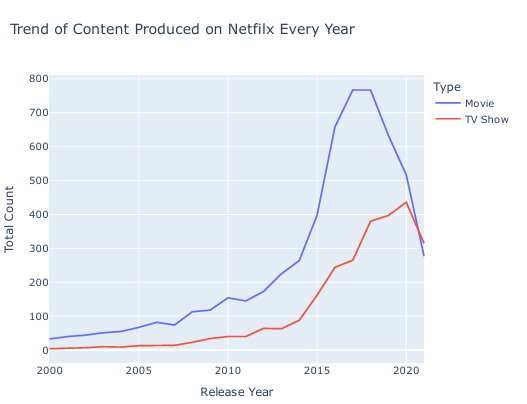
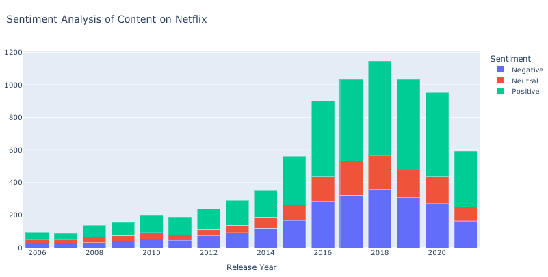

# Netflix Content & Sentiment Analysis — Python

## Business Objective

This project explores Netflix's movie and TV-show catalog to understand content composition, contributor patterns, production trends, and the sentiment expressed in title descriptions.

The goal is to demonstrate how Python can be used to turn a media dataset into structured business-style insights.

## Dataset

- **File:** `netflix_titles.csv`
- **Rows:** 8,807
- **Columns:** 12
- **Key fields:** title, type, director, cast, country, release_year, rating, duration, listed_in, description

## Business Questions

- What content ratings are most common?
- Which directors and actors appear most frequently?
- How has content production changed over time?
- What is the balance between movies and TV shows?
- What sentiment is present in title descriptions?

## Analysis Performed

### Content Distribution

The project examines the distribution of Netflix titles by content rating and type.

### Contributor Analysis

The analysis identifies the most frequent directors and actors in the dataset.

### Production Trend

Content production is analyzed across release years to identify changes in catalog growth.

### Sentiment Analysis

TextBlob is used to classify descriptions into:

- Positive
- Negative
- Neutral

## Key Findings

The existing analysis reports:

- **TV-MA** as the most common rating.
- **Rajiv Chilaka** as the most frequent director in the analyzed dataset.
- **Anupam Kher** among the most frequent actors.
- Strong catalog growth after 2015.
- Positive sentiment as the largest sentiment category, with a substantial neutral share.

## Interview Talking Points

The project demonstrates:

**Data exploration → categorical analysis → trend analysis → text preprocessing/analysis → visualization → interpretation**

It is particularly useful for explaining how unstructured text fields can be converted into analytical features and incorporated into a broader EDA workflow.

## Repository Files

- `Netflix_Data_Analysis.ipynb` — analysis notebook
- `netflix_titles.csv` — dataset
- `Netflix_Data_Analysis.ipynb - Colab.pdf` — notebook export
- PNG files — analysis outputs

## Tech Stack

**Python | Pandas | Matplotlib | Seaborn | TextBlob | Jupyter/Colab**
