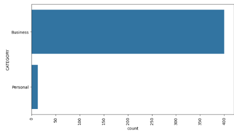
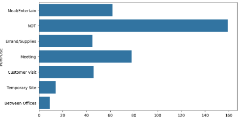
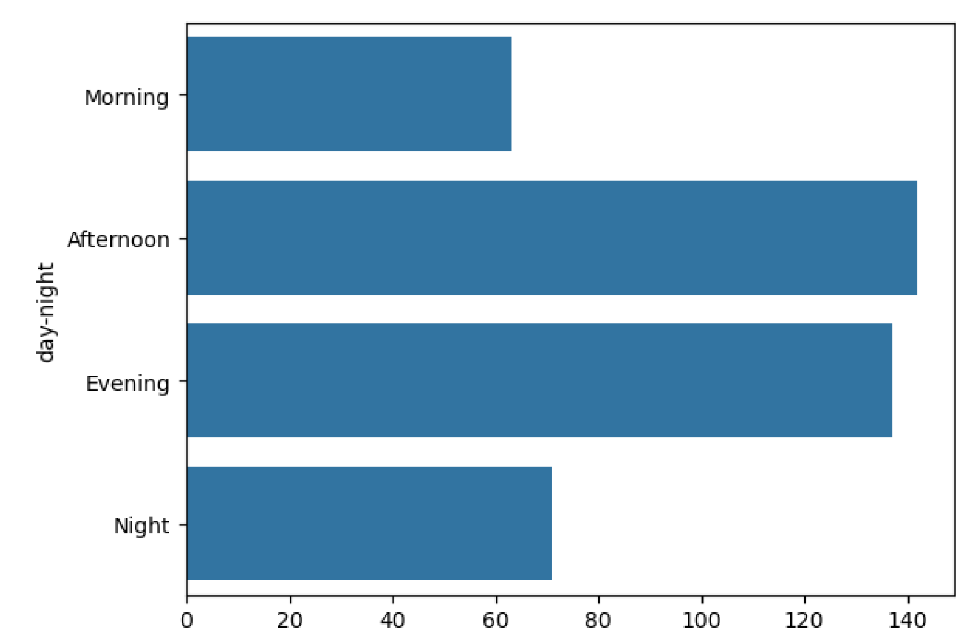
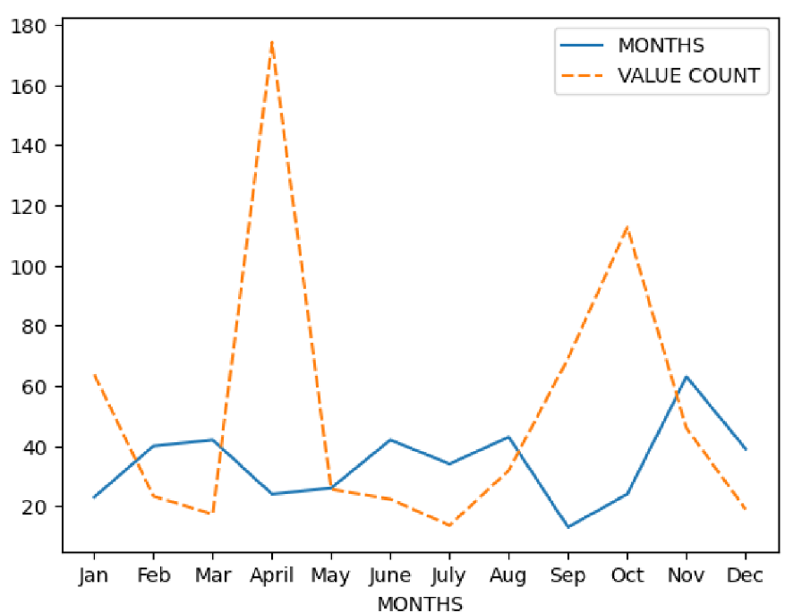
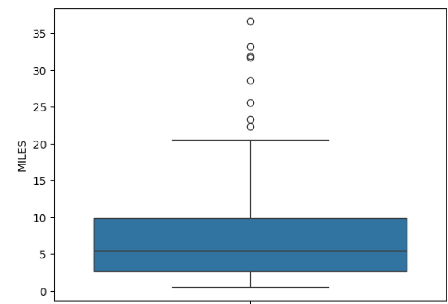

# 🚖 Uber Data Analysis  

## 📌 Problem Statement  
Understanding ride patterns is important for both Uber and users.  
This project analyzes an **Uber ride dataset** to answer:  
- What type of rides do people book most often?  
- What are the common purposes of booking?  
- When (time of day, month, weekday) do people prefer booking rides?  
- What distances do people typically travel?  

The goal is to find **patterns and insights** that could be useful for decision-making and future predictions.  

---

## 📂 Dataset  
- **File**: `UberDataset.csv`  
- **Rows**: 1156  
- **Columns**:  
  - `START_DATE` → Ride start date & time  
  - `END_DATE` → Ride end date & time  
  - `CATEGORY` → Ride type (Business/Personal)  
  - `START` → Start location  
  - `STOP` → Stop location  
  - `MILES` → Distance traveled  
  - `PURPOSE` → Purpose of ride  

---

## ⚙️ Data Preprocessing  
✔️ Missing values in **PURPOSE** filled with `"not"`  
✔️ Converted `START_DATE` & `END_DATE` to datetime format  
✔️ Extracted new features:  
- `DATE`, `TIME`  
- `Day_Night` (Morning, Afternoon, Evening, Night)  
- `Month`, `DAY`, `DAY_Name`  
✔️ Removed null values after transformations  

---

## 📊 Exploratory Data Analysis  

### 1️⃣ Which ride **category** is most booked?  
📌 Observation: **Business** category dominates.  

  

---

### 2️⃣ What is the most common **purpose** of rides?  
📌 Observation: **Meetings** are the top purpose.  

  

---

### 3️⃣ At what **time of day** are most rides booked?  
📌 Observation: Afternoon & Evening show peak rides.  

  

---

### 4️⃣ Which **months** have fewer bookings?  
📌 Observation: Winter months (Jan, Feb, Nov, Dec) show lower demand.  

  

---

### 5️⃣ On which **day of the week** are most rides booked?  
📌 Observation: **Friday** has the highest bookings.  

  

---

### 6️⃣ What is the **typical ride distance**?  
📌 Observation: Most rides are within **0–20 miles**.  

  

---

## 📈 Key Insights / Metrics  
- 📍 **Business trips** account for most rides  
- 📍 **Meetings** dominate ride purposes  
- 📍 **Afternoon & Evening** = peak ride times  
- 📍 **Short rides (<20 miles)** are most common  

---

## 🛠️ Tech Stack  
- Python 🐍  
- pandas | numpy | matplotlib | seaborn  

---

## 🏁 Conclusion  
This project highlights how Uber rides are primarily for **business and meetings**, with peak demand in the **afternoons/evenings** and **short-distance trips** being most common.  

📌 Future Work:  
- Perform **geospatial analysis** on start/stop locations  
- Build a **demand prediction model**  
- Deploy an interactive dashboard with **Streamlit / Plotly**  

---
